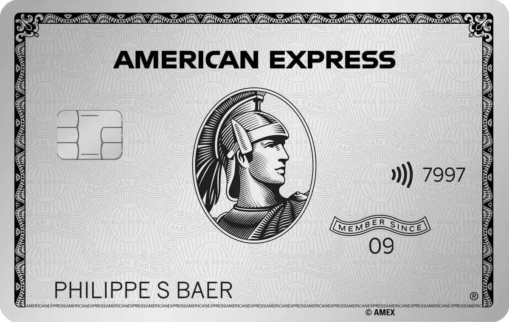

# American Express Inspired Landing Page

A modern animated landing page inspired by the American Express Platinum experience.  
This project showcases smooth scrolling animations, modern UI design, and interactive elements using HTML, CSS, JavaScript, and GSAP.

---

## 🚀 Live Demo

🔗 https://anushkabandil.github.io/American-Express-website/

---

## ✨ Features

- Smooth scroll animations using **GSAP**
- Modern **responsive UI design**
- Animated sections and transitions
- Clean and structured layout
- Icon integration using **Remix Icons**

---

## 🛠️ Built With

- **HTML5**
- **CSS3**
- **JavaScript**
- **GSAP (ScrollTrigger)**
- **Remix Icons**

---

## 📂 Project Structure

```
American-Express
│
├── index.html
├── style.css
├── script.js
└── images
    ├── americanExpress.jpeg
    ├── background.jpg
    ├── family.avif
    └── ...
```

---

## 📸 Preview



---

## 💡 Purpose

This project was created to practice:

- Frontend UI design
- Scroll animations with GSAP
- Landing page layout structure
- GitHub project deployment

---

## 👩‍💻 Author

**Anushka Bandil**

GitHub:  
https://github.com/anushkabandil

---

⭐ If you like this project, consider giving it a **star**!
